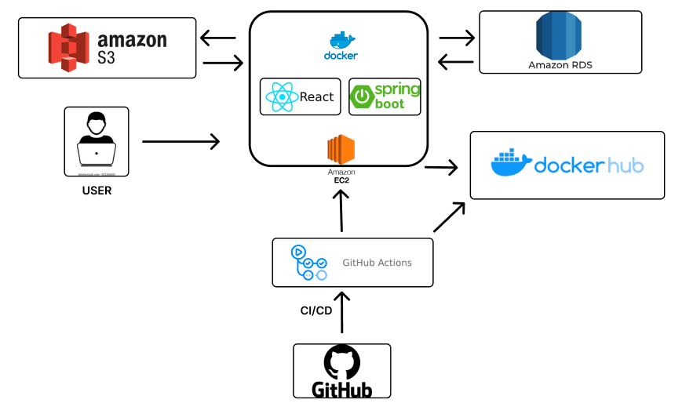
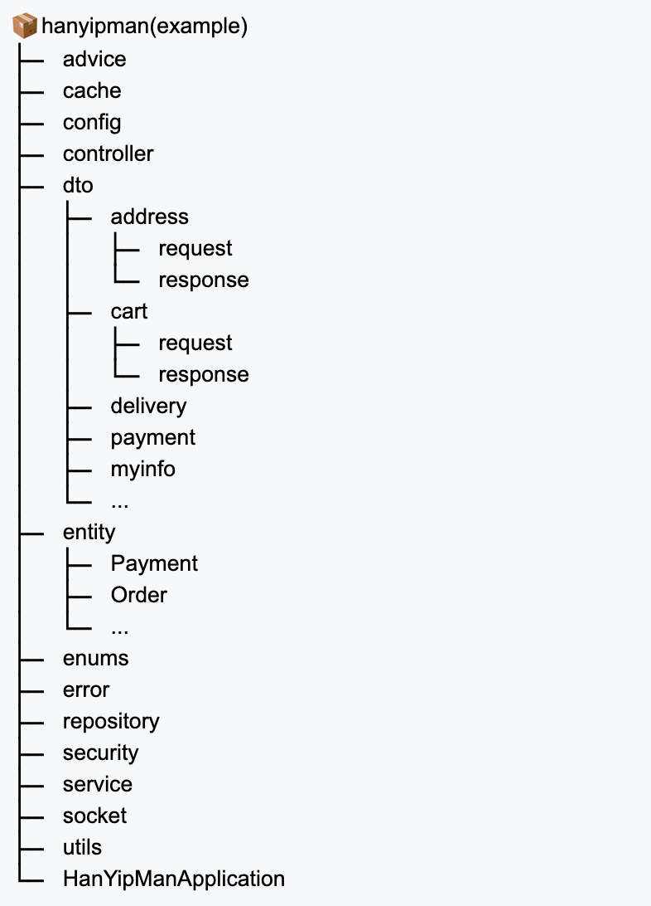

<header>

<h1 class="projectName">Han-Yip-Man-back</h1>
</header>

한입만의 백엔드 레포입니다!

### 🍽️ 프로젝트명 (Project name)

한입만(Han-Yip-Man)

 

### 🍽️ 프로젝트 소개 (Introduction)

주소기반으로 한 주변 배달가능지역에서 음식을 주문하고
드론으로 배달되는 푸드 오더 딜리버리 웹 서비스입니다.

 

### 🍽️ 주요 기능 (Main feature)

🍗 **회원가입 및 로그인 (Sign-up and log-in)**

- 사장님 혹은 손님으로 회원가입 및 로그인 가능 
- 소셜로그인(카카오 로그인) 가능

🍗 **메인페이지 (Main page)**

- 음식 카테고리별로 관련 음식점들 노출
- 맛집 이름 검색 기능
- 최신순, 리뷰순, 평점순, 거리순 각각 기준에 따른 음식점 정렬

🍗 **주소 (Address)**

- 주소 입력 후 주소 기반 주변 맛집 보여 주는 기능
- 여러 주소 추가 기능

🍗 **마이페이지 (My page)**

- 마이페이지에서 주문 상태, 주문 내역, 결제 내역 등 볼 수 있는 기능

🍗 **사장님 (Restaurant owner)**

- 사장님의 가게관리(가게, 메뉴, 대분류),주문관리 기능
- 사장님의 판매내역 확인 기능

🍗 **주문 및 결제 (Cart, order and payment)**

- 장바구니, 주문, 결제 기능
- 결제 중 취소시 장바구니 내용물 롤백
- 주문 프로세스에 따른 상태값 변경 기능 

 

### 🍽️ 백엔드 기술스택 (Backend technologies used)

- Spring boot
- Spring security
- MySQL
- Swagger
- AmazonAWS
- Docker
- Github action

 

### 🍽️ 팀소개 (Team member)

| FE | BE |
|:--:|:--:|
| 성우 | 원호 |
| 동욱 | 주환 |
| 지인 | 민승 |
| 지환 | 우진 |
| x  | 지원 |

 

### 🍽️ 프로젝트 기간 (Project duration)

2023.08.28~2023.09.22 (약 4주)

 

### 🍽️ 관련링크 (Project links)

- 배포주소(Deployment): http://54.180.103.214:8080/
- 팀 노션(Team notion): https://www.notion.so/d057e339e7cc453096f917b856b4061d

 

### 🍽️ 서비스 아키텍처 (Service architecture)

 
 
 

### 🍽️ 프로젝트 구조 (Project structure)

 
 
 
 

